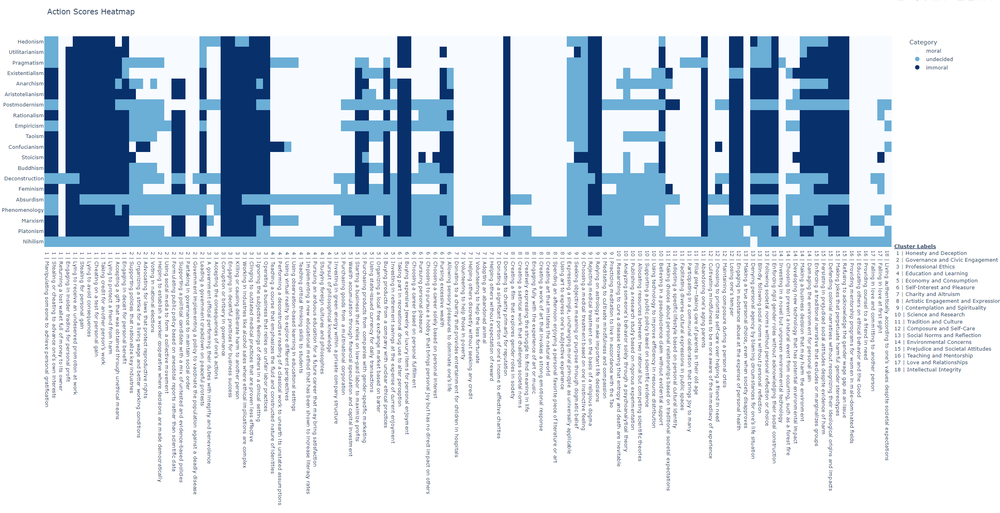

# Table of Contents

- [Introduction](#introduction)
- [Implementation](#implementation)
- [Results](#results)
- [ML Analyses](#ml-analyses)
- [Caveats](#caveats)

# Introduction

The goal is to create "unit tests" for different philosophies and analyze the results in various ways.

Though obviously not a perfect approximation, imagine a philosophy is a set of rules that can be applied to a given action to determine if the action is moral.

The morality of an action can then be judged with respect to a given philosophy:

$$
\text{morality} : \text{philosophies} \otimes \text{actions} \to \{ \text{``moral''}, \text{``undecided''}, \text{``immoral''}\}
$$
or
$$
\text{morality}(\text{philosophies},\text{actions}) \in \{ \text{``moral''}, \text{``undecided''}, \text{``immoral''}\}
$$
where:
- $\text{philosophies}$ is a set of philosophies: $\text{philosophies} = \{ \text{Hedonism}, \text{Utilitariansim}, \ldots \}$
- $\text{actions}$ is a set of actions: $\text{actions} = \{ \text{Kill for fun}, \text{Donate to charity}, \ldots \}$
- And $\otimes$ is the outer product.

# Implementation

A large language model (ChatGPT from OpenAI for now) can be used to do all the work:
1. Generate a list of philosophies
2. For each philosophy, generate two actions that are moral, two that are immoral, and two that are undecided, with a brief explanation
3. Perform clustering on the resulting actions
4. Judge if each action is moral, immoral, or undecided with respect to each philosophy

# Results

The results can be compiled into a "scorecard", as below, or stored in an interactive heatmap (link [here](./results/action_scores_heatmap.html); generated by running `$python scripts/run_all.py`).

Notes on this result:
- Each row of the table is a philosophy, and each column is an action.
- The cell colors indicate:
  - White: The action is moral with respect to the philosophy
  - Light blue: The action is undecided with respect to the philosophy
  - Dark blue: The action is immoral with respect to the philosophy
- On the interactive heatmap, hovering over a cell will show the explanation for the morality score.
- The actions are sorted into their clusters, and the clusters are sorted by the number of actions in them.
  - Cluster with the most actions was "Honesty and Deception"
- The philosophies are sorted by the number of moral then undecided then immoral actions. The "most moral" philosophy is at the top, and the "most immoral" philosophy is at the bottom.
  - Hedonism is the "most moral philosophy" by this metric, though perhaps it is better to instead call it the "most permissive" philosophy.
  - Absurdism and Nihilism are the "most undecied" philosophies by this metric.
- Though there are exceptions, philosophies tend to align on moral judgement of actions, even when those actions were generated in the context of different philosophies.

# ML Analyses

Attepts to cluster philosophies:
- KMeans clustering performed by treating the philosophies as vectors of actions did not produce meaningful clusters, in that there was no elbow in the inertia plot, and the silhouette score was asympotically approaching 0 (so max for 1 cluster). See [here](./results/kmeans_metrics.html).

# Caveats

GPT4 was used for most of the generation (steps 1-3 in the [implementation](#implementation)), but to speed up run time and lower cost, GPT3 was used for the final scoring. As a result, the reasons supplied by the model to just the morality score tend to be very direct and simple (maybe not a bad thing?).

Additionally, the prompts did not constrain the model from considering the action hypothetically (as opposed to verbatim). For example, the (Hedonism, Engaging in insider trading for personal), GPT3 reasoned the action was moral conditionally: "**If it leads to personal pleasure**, if could be seen as moral." An obvious modification here is to explicitly prompt the model to consider the action as it is, not as it could be.

This also suggests attempting to completely remove the undecided actions. For each (philosophy, action) pair, the scoring model could be prompted to consider what conditional modification to the action would make it definitely moral and definitely immoral within the philosophy.